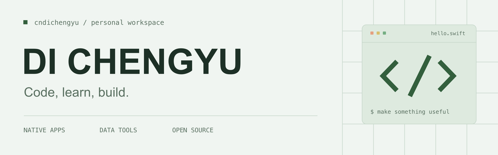
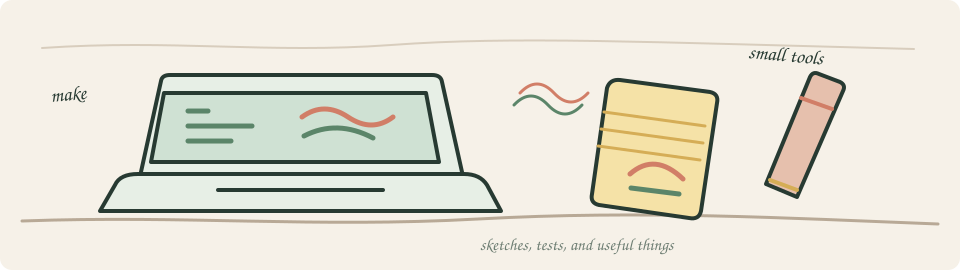

<picture>
  <source media="(prefers-color-scheme: dark)" srcset="./assets/header-dark.png">
  <source media="(prefers-color-scheme: light)" srcset="./assets/header-light.png">
  
</picture>

  <a href="#精选项目">精选项目</a> &nbsp; / &nbsp;
  <a href="#技术栈">技术栈</a> &nbsp; / &nbsp;
  <a href="#github-动态">GitHub 动态</a> &nbsp; / &nbsp;
  <a href="mailto:cndichengyu@163.com">联系我</a>

  <b>于繁华处看见世界，于孤独中寻找自己。</b> 
  写一点代码，把想法变成用得上的工具。

## 精选项目

<!-- PROJECTS:START -->
<table>
  <tr>
    <td width="50%" valign="top">
       
      DESKTOP TOOL
      <h3><a href="https://github.com/cndichengyu/DiskThings">DiskThings</a></h3>
      
macOS 原生外置硬盘管理工具，集中查看设备与健康信息。

      
<code>Swift</code> <code>SwiftUI</code> <code>macOS</code> · ★ 1 · ⑂ 0 · 更新于 2026-07-30

    </td>
    <td width="50%" valign="top">
       
      MOBILE TOOL
      <h3><a href="https://github.com/cndichengyu/NetSessionTester-iOS">NetSessionTester-iOS</a></h3>
      
网络诊断工具的 iOS 原生移植，覆盖 TCP、Ping、DNS、NAT 与路由探测。

      
<code>Swift</code> <code>SwiftUI</code> <code>iOS</code> · ★ 0 · ⑂ 0 · 更新于 2026-08-09

    </td>
  </tr>
  <tr>
    <td width="50%" valign="top">
       
      NAS APPLICATION
      <h3><a href="https://github.com/cndichengyu/fnos-aria2">fnos-aria2</a></h3>
      
为飞牛 fnOS 封装的 Aria2 下载应用，支持 JSON-RPC 与 x86 / ARM 双架构。

      
<code>Shell</code> <code>Aria2</code> <code>fnOS</code> · ★ 0 · ⑂ 0 · 更新于 2026-08-20

    </td>
    <td width="50%" valign="top">
       
      LEARNING NOTES
      <h3><a href="https://github.com/cndichengyu/go-learning-tutorial">go-learning-tutorial</a></h3>
      
系统化的 Go 语言学习教程，从基础语法走向并发、Web 开发与项目实践。

      
<code>Go</code> <code>Markdown</code> <code>Learning</code> · ★ 0 · ⑂ 0 · 更新于 2026-05-29

    </td>
  </tr>
</table>
<!-- PROJECTS:END -->

**Python 数据工具** &nbsp; [B 站评论](https://github.com/cndichengyu/GetBiliComments) · [抖音评论](https://github.com/cndichengyu/GetDouyinComments) · [微博评论](https://github.com/cndichengyu/weibo-get)

[查看全部仓库](https://github.com/cndichengyu?tab=repositories)

## 技术栈

<picture>
  <source media="(prefers-color-scheme: dark)" srcset="./assets/skills-dark.svg">
  <source media="(prefers-color-scheme: light)" srcset="./assets/skills-light.svg">
  
</picture>

**应用与服务** &nbsp; SwiftUI · Spring · Flask · Vue 
**数据与环境** &nbsp; MySQL · Redis · Docker · Linux 
**Web 与工具** &nbsp; HTML · CSS · JavaScript · jQuery · Markdown · VS Code

## GitHub 动态

<table>
  <tr>
    <td width="50%">
      <picture>
        <source media="(prefers-color-scheme: dark)" srcset="https://github-profile-summary-cards.vercel.app/api/cards/stats?username=cndichengyu&amp;theme=github_dark">
        <source media="(prefers-color-scheme: light)" srcset="https://github-profile-summary-cards.vercel.app/api/cards/stats?username=cndichengyu&amp;theme=github">
        
      </picture>
    </td>
    <td width="50%">
      <picture>
        <source media="(prefers-color-scheme: dark)" srcset="https://github-profile-summary-cards.vercel.app/api/cards/repos-per-language?username=cndichengyu&amp;theme=github_dark">
        <source media="(prefers-color-scheme: light)" srcset="https://github-profile-summary-cards.vercel.app/api/cards/repos-per-language?username=cndichengyu&amp;theme=github">
        
      </picture>
    </td>
  </tr>
</table>

<picture>
  <source media="(prefers-color-scheme: dark)" srcset="./assets/footer-sketch-dark.svg">
  <source media="(prefers-color-scheme: light)" srcset="./assets/footer-sketch-light.svg">
  
</picture>

---

  <a href="mailto:cndichengyu@163.com">cndichengyu@163.com</a> 
  Keep learning. Keep building.

